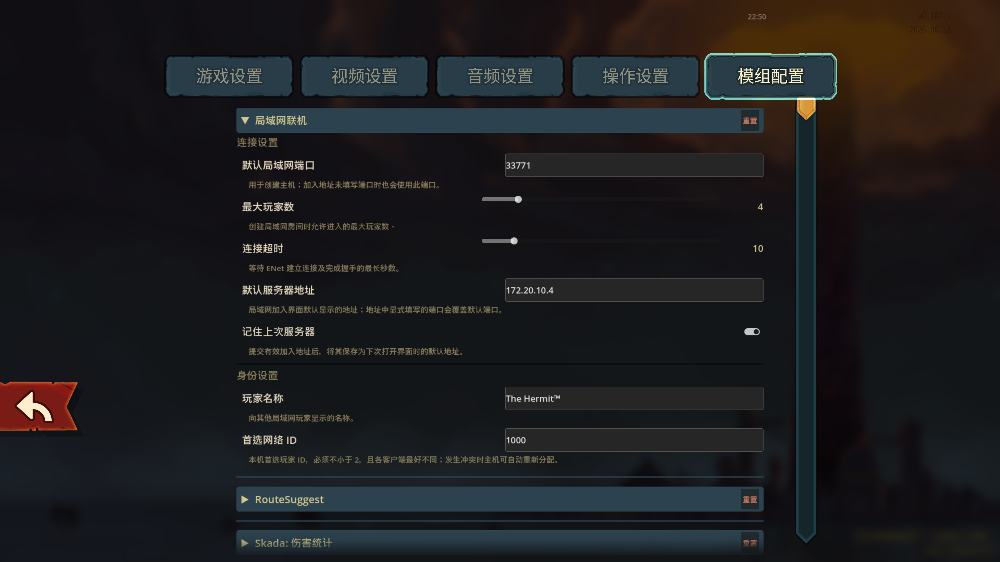

# SlayTheSpire2.LAN.Multiplayer.Reforged


A community-maintained fork of **SlayTheSpire2.LAN.Multiplayer** for **Slay the Spire 2**.

This project updates the original LAN Multiplayer mod to remain compatible with newer versions of Slay the Spire 2 while preserving the original gameplay and networking experience.

It replaces the standard online transport path with a direct ENet connection, allowing players on the same local network—or a virtual LAN—to host and join multiplayer games without relying on Steam lobbies or external matchmaking services.

> This is an unofficial community project and is not affiliated with Mega Crit.

* [English](README.md)
* [简体中文](README.zh-CN.md)

---

## Acknowledgements

This project is a fork of **SlayTheSpire2.LAN.Multiplayer** created by **kmyuhkyuk**.

Original repository:

https://github.com/kmyuhkyuk/SlayTheSpire2.LAN.Multiplayer

This fork focuses on maintaining compatibility with newer versions of Slay the Spire 2 and fixing issues that prevent the original project from working on current builds.

All credit for the original implementation belongs to the original author.

The original project is licensed under GPL-3.0.

This fork continues to be distributed under GPL-3.0.

---

## Features

* Host multiplayer games over a local network
* Join a host by entering an IP address and port
* Standard, Daily and Custom multiplayer runs
* Continue saved LAN multiplayer runs
* Separate save data for LAN multiplayer runs
* Displays local IPv4, IPv6 and public connection addresses
* Click an address to copy it
* Uses the game's existing multiplayer synchronization logic
* Compatible with other mods when every player uses the same setup

---

## Requirements

* Slay the Spire 2
* Windows
* The same game version on every computer
* The same version of this mod on every computer
* The same gameplay-changing mods and load order on every computer

Tested with:

```text
Slay the Spire 2 v0.107.1
Godot 4.5.1 Mono
.NET 9
```

Because Slay the Spire 2 is still being actively updated, future game versions may change internal APIs and require this mod to be rebuilt or updated.

---

## Installation

1. Download the latest release.
2. Extract the archive.
3. Copy the included `mods` folder into the Slay the Spire 2 installation directory.

Example:

```text
Slay the Spire 2/
├─ SlayTheSpire2.exe
└─ mods/
   └─ SlayTheSpire2.LAN.Multiplayer.Reforged/
      ├─ mod_manifest.json
      ├─ SlayTheSpire2.LAN.Multiplayer.Reforged.dll
      └─ SlayTheSpire2.LAN.Multiplayer.Reforged.pck
```

4. Start the game.
5. Confirm that the game reports that it is running modded.

---

## Hosting a LAN Game

1. Start Slay the Spire 2.
2. Open the multiplayer menu.
3. Select the LAN hosting option.
4. Choose Standard, Daily or Custom mode.
5. Share the displayed address with the other players.

The host must keep the game open while other players connect.

---

## Joining a LAN Game

1. Start Slay the Spire 2.
2. Open the multiplayer join screen.
3. Locate the LAN connection panel.
4. Enter the host's address.
5. Press the LAN join button.

Supported address formats include:

```text
192.168.1.100
192.168.1.100:33771
localhost
http://192.168.1.100:33771
```

---

## Playing Through a Virtual LAN

The mod can also work through virtual LAN software, provided that every player can directly reach the host's virtual IP address.

Common options include:

* Tailscale
* ZeroTier
* Radmin VPN
* Hamachi

Enter the host's virtual LAN address in the join screen exactly as you would enter a normal local IP address.

---

## Mod Compatibility

All players should use the same:

* Game version
* LAN Multiplayer Reforged version
* Gameplay-changing mods
* Mod versions
* Mod load order

Cosmetic differences may work, but identical installations are strongly recommended.

Differences in cards, relics, characters, events, enemies, acts or synchronization-related patches can cause connection failures or desynchronization.

For troubleshooting, first test with only this mod enabled.

---

## Building from Source

### Prerequisites

* .NET 9 SDK
* Git
* An installed copy of Slay the Spire 2

Clone the repository:

```powershell
git clone https://github.com/PageSecOnd/SlayTheSpire2.LAN.Multiplayer.Reforged.git
cd SlayTheSpire2.LAN.Multiplayer.Reforged
```

Build:

```powershell
dotnet restore
dotnet build .\SlayTheSpire2.LAN.Multiplayer.Reforged.sln -c Release
```

The compiled DLL will normally be located at:

```text
SlayTheSpire2.LAN.Multiplayer.Reforged/
bin/Release/net9.0/
```

---

## Troubleshooting

### The mod does not appear in the game

Verify that the mod folder is placed directly inside the game's `mods` directory and contains `mod_manifest.json`.

### The client cannot connect

Verify that:

* The host has already opened a LAN lobby
* The IP address is correct
* The port is correct
* Both computers are on the same LAN or virtual LAN
* Windows Firewall allows the game
* The host and client use the same game version
* The host and client use the same mod version

### Connection timed out

A timeout usually indicates that the client cannot reach the host.

Check:

* The host is still in the multiplayer lobby
* The host address is reachable
* The selected port is not blocked
* The virtual LAN connection is active
* A VPN is not routing the connection through the wrong interface

### Players disconnect or desynchronize

Temporarily disable every other mod and test again.

If the problem disappears, re-enable mods in small groups until the incompatible mod is identified.

All participants should use matching mod versions and load order.

---

## Screenshots




---

## Contributing

Bug reports and pull requests are welcome.

When reporting a problem, include:

* Game version
* Mod version
* Full game log
* Host and client operating systems
* Installed mod list
* Steps required to reproduce the issue

---

## License

This project is licensed under the GNU General Public License v3.0.

See [LICENSE](LICENSE) for details.
