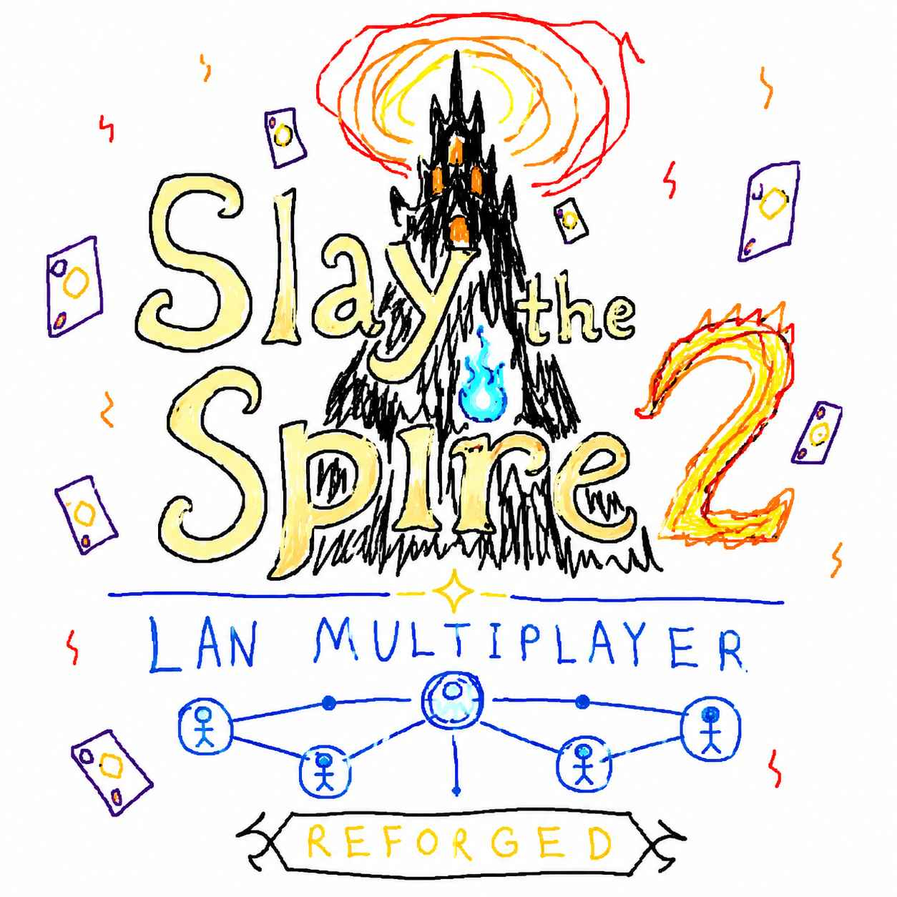

# SlayTheSpire2.LAN.Multiplayer.Reforged



一个面向 **《杀戮尖塔 2》** 的 **SlayTheSpire2.LAN.Multiplayer** 社区维护版 Fork。

本项目旨在让原版 LAN Multiplayer Mod 持续兼容新版《杀戮尖塔 2》，同时尽可能保持原有的联机体验与游戏玩法不变。

该 Mod 使用直接的 ENet 网络连接替代标准在线传输路径，使玩家能够在同一局域网或虚拟局域网环境下创建和加入多人游戏，而无需依赖 Steam 房间或其他外部匹配服务。

> 本项目为非官方社区项目，与 Mega Crit 无任何关联。

* [English](README.md)
* [简体中文](README.zh-CN.md)

---

## 致谢

本项目基于 **kmyuhkyuk** 开发的 **SlayTheSpire2.LAN.Multiplayer** 修改而来。

原项目地址：

https://github.com/kmyuhkyuk/SlayTheSpire2.LAN.Multiplayer

本 Fork 主要专注于适配新版《杀戮尖塔 2》，并修复导致原项目无法在当前版本正常运行的问题。

原项目的核心设计与实现版权归原作者所有。

原项目采用 GPL-3.0 协议发布。

本 Fork 继续依据 GPL-3.0 协议进行发布。

---

## 功能特性

* 通过局域网创建多人游戏房间
* 通过 IP 地址和端口加入主机
* 支持标准模式、每日挑战模式和自定义模式多人游戏
* 支持继续之前保存的局域网多人存档
* 使用独立的局域网多人游戏存档
* 显示本地 IPv4、IPv6 以及公网连接地址
* 点击地址即可复制
* 使用游戏原有的多人同步逻辑
* 在所有玩家使用相同配置时兼容其他 Mod

---

## 运行要求

* 《杀戮尖塔 2》
* Windows
* 所有玩家使用相同的游戏版本
* 所有玩家使用相同版本的本 Mod
* 所有玩家使用相同的游戏内容 Mod 及加载顺序

测试环境：

```text
Slay the Spire 2 v0.107.1
Godot 4.5.1 Mono
.NET 9
```

由于《杀戮尖塔 2》仍处于持续更新阶段，未来游戏版本可能修改内部 API，因此本 Mod 可能需要重新编译或更新。

---

## 安装方法

1. 下载最新版本。
2. 解压压缩包。
3. 将其中的 `mods` 文件夹复制到《杀戮尖塔 2》的安装目录。

目录结构示例：

```text
Slay the Spire 2/
├─ SlayTheSpire2.exe
└─ mods/
   └─ SlayTheSpire2.LAN.Multiplayer.Reforged/
      ├─ mod_manifest.json
      ├─ SlayTheSpire2.LAN.Multiplayer.Reforged.dll
      └─ SlayTheSpire2.LAN.Multiplayer.Reforged.pck
```

4. 启动游戏。
5. 确认游戏已正确识别并运行 Mod。

---

## 创建局域网房间

1. 启动《杀戮尖塔 2》。
2. 打开多人游戏菜单。
3. 选择局域网创建房间。
4. 选择标准模式、每日挑战模式或自定义模式。
5. 将显示的地址分享给其他玩家。

在其他玩家连接期间，主机必须保持游戏开启。

---

## 加入局域网房间

1. 启动《杀戮尖塔 2》。
2. 打开多人游戏加入界面。
3. 找到局域网连接面板。
4. 输入主机地址。
5. 点击局域网加入按钮。

支持以下地址格式：

```text
192.168.1.100
192.168.1.100:33771
localhost
http://192.168.1.100:33771
```

---

## 通过虚拟局域网进行联机

本 Mod 同样支持虚拟局域网软件，只要所有玩家都能够直接访问主机的虚拟 IP 地址即可。

常见选择包括：

* Tailscale
* ZeroTier
* Radmin VPN
* Hamachi

只需在加入界面输入主机的虚拟局域网地址，即可像普通局域网一样连接。

---

## Mod 兼容性

所有玩家应确保以下内容一致：

* 游戏版本
* LAN Multiplayer Reforged 版本
* 影响游戏内容的 Mod
* Mod 版本
* Mod 加载顺序

仅视觉类 Mod 可能允许存在差异，但仍强烈建议所有玩家保持完全一致的安装环境。

卡牌、遗物、角色、事件、敌人、地图章节或同步逻辑相关补丁的差异都可能导致连接失败或同步错误。

排查问题时，建议首先仅启用本 Mod 进行测试。

---

## 从源码编译

### 环境要求

* .NET 9 SDK
* Git
* 已安装的《杀戮尖塔 2》

克隆仓库：

```powershell
git clone https://github.com/<your-name>/SlayTheSpire2.LAN.Multiplayer.Reforged.git
cd SlayTheSpire2.LAN.Multiplayer.Reforged
```

编译：

```powershell
dotnet restore
dotnet build .\SlayTheSpire2.LAN.Multiplayer.sln -c Release
```

生成的 DLL 通常位于：

```text
SlayTheSpire2.LAN.Multiplayer/
bin/Release/net9.0/
```

---

## 故障排除

### 游戏中看不到 Mod

请确认 Mod 文件夹直接位于游戏的 `mods` 目录下，并且包含 `mod_manifest.json` 文件。

### 客户端无法连接

请确认：

* 主机已创建局域网房间
* IP 地址正确
* 端口正确
* 双方位于同一局域网或虚拟局域网
* Windows 防火墙已放行游戏
* 主机与客户端使用相同游戏版本
* 主机与客户端使用相同 Mod 版本

### 连接超时

连接超时通常意味着客户端无法访问主机。

请检查：

* 主机仍处于多人游戏大厅中
* 主机地址可访问
* 端口未被阻止
* 虚拟局域网连接正常
* VPN 未将连接路由到错误网卡

### 玩家掉线或同步异常

请先禁用其他所有 Mod 后重新测试。

如果问题消失，请逐步启用其他 Mod，以定位具体不兼容的 Mod。

所有参与联机的玩家都应使用相同版本的 Mod 和相同加载顺序。

---

## 截图


---

## 贡献

欢迎提交 Bug 报告和 Pull Request。

提交问题时，请尽量提供：

* 游戏版本
* Mod 版本
* 完整游戏日志
* 主机与客户端操作系统
* 已安装 Mod 列表
* 问题复现步骤

---

## 许可证

本项目采用 GNU General Public License v3.0（GPL-3.0）协议发布。

详情请参阅 [LICENSE](LICENSE)。
